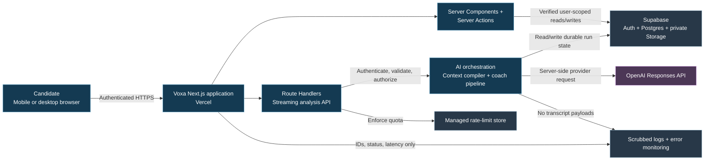
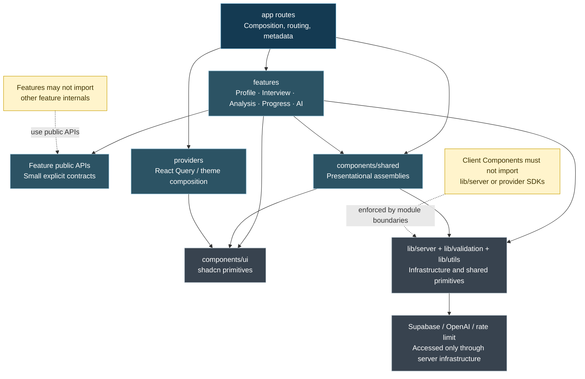
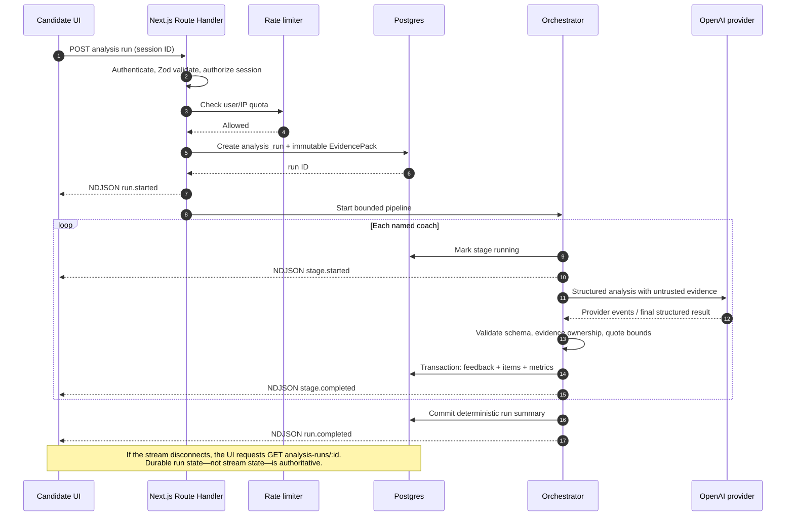
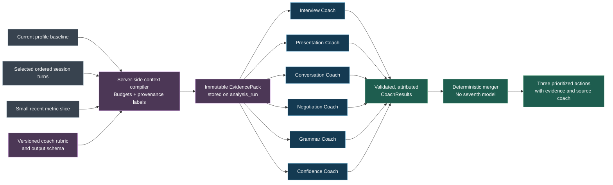
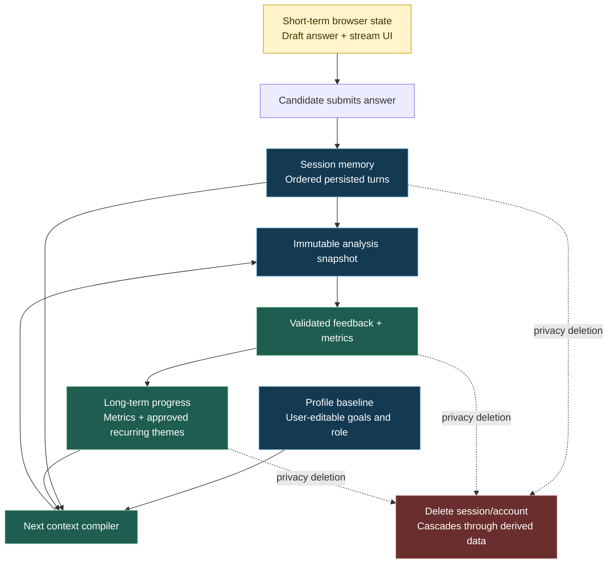
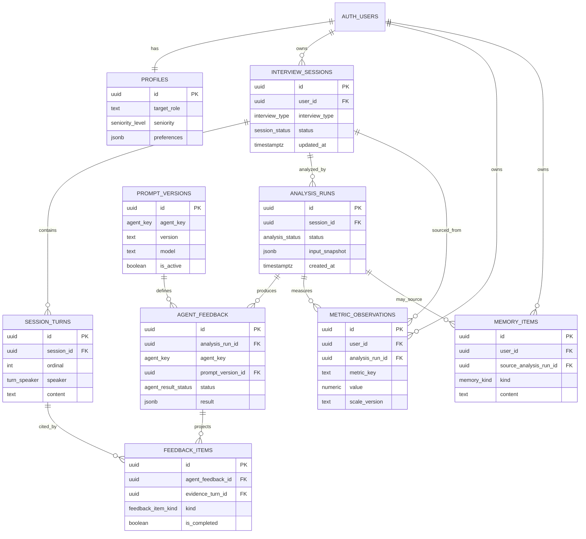

# Voxa Mermaid Diagrams

These diagrams are part of the architecture, not decoration. They show the boundaries that keep the MVP simple now and make its future evolution legible.

## 1. System context and trust boundaries

**Boundary rule:** The browser has a user session but never a service-role or AI-provider secret. The only outbound AI call originates from the server after identity, ownership, size, and rate-limit checks.

## 2. Modular monolith dependency direction

## 3. Analysis request, streaming, and recovery

## 4. Coach independence and context assembly

**Important:** The arrows fan out from a common EvidencePack. The listed coach order controls progress presentation, but no coach's scorecard is silently supplied to another coach.

## 5. Memory lifecycle

## 6. Entity relationship diagram

The `agent_feedback.result` JSONB field preserves the complete validated model artifact; `feedback_items` and `metric_observations` are intentional query projections for the product UI.
